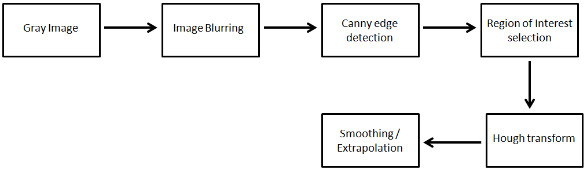
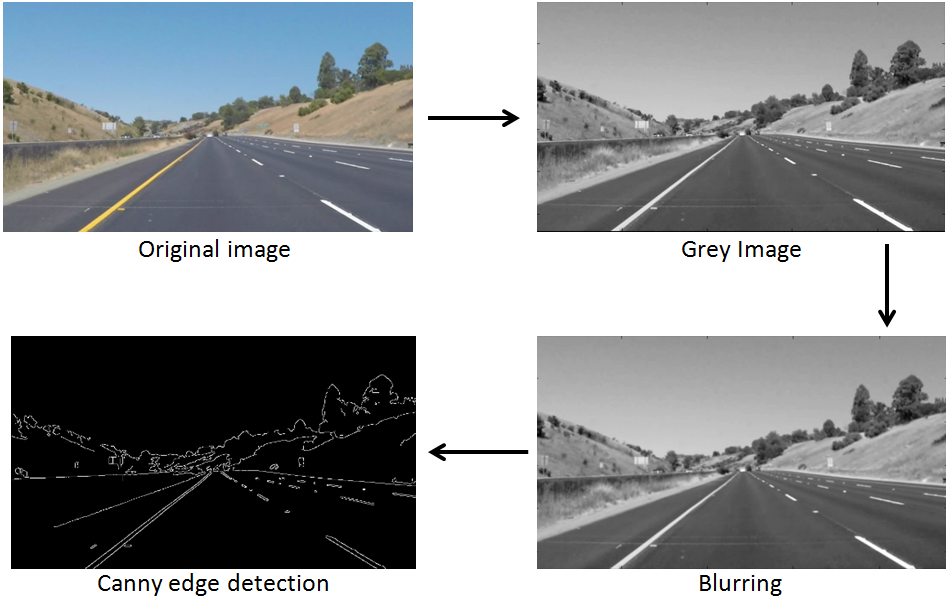
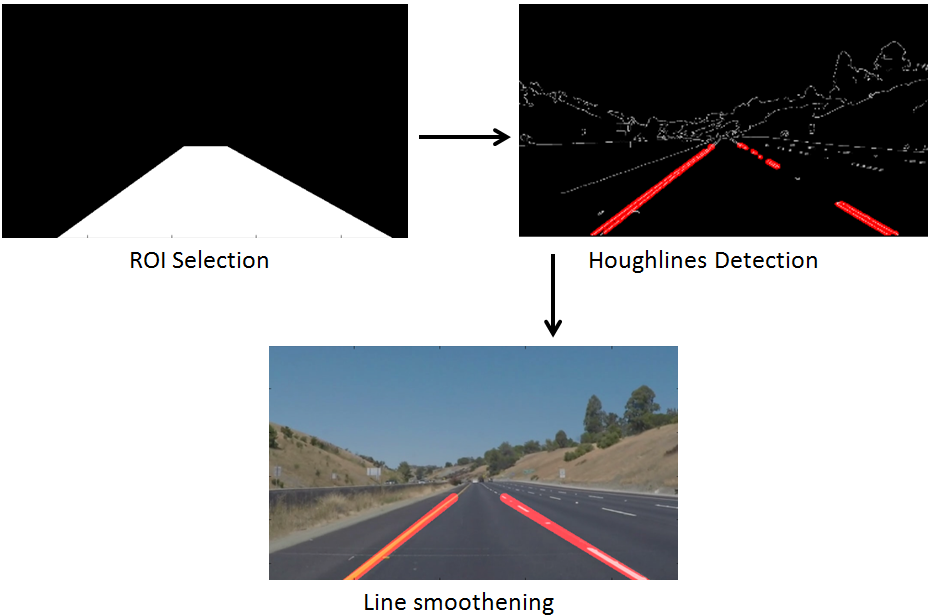

# **Finding Lane Lines on the Road** 

---
### Project Overview

In this project python and opencv was used to detect lane lines on road image. The block diagram of
complete pipeline is given below:

[//]: # (Image References)

[image1]: ./examples/grayscale.jpg "Grayscale"

---

### Algorithm Explanation

1. Input image is changed to grey scale image.
2. Gaussian blurring is applied.
3. Edges are detected with Canny edge detection Algorithm.

4. If the image after edge detection is given directly to line detection function, then lines will be detected 
 over all image. This would cause unnecessary computation and also would also result in erronous line in 
  the final result. Hence region of interest is selected which mask all the unwanted region and apply line detection only 
  on the selected area.
5. Lines detected afterwards are still too many, so lines are categorized into right and left line by keeping a check on sign of slopes 
of lines. In the end avergaing is applied to slopes and intercepts to get one smooth line for each side.
The result line is overlayed on coloured image and displayed.

### 2. Conclusion

This project successfully detects lane lines on straight road. Videos images shows that lane lines are 
properly detected and lines are also smooth.

This algorithm however assumes that car will be driving straight on the road hence it detect only straight
lines. To detect lane lines on curved road we would need to use inverse perspective mapping and fit 
higher degree polynomial instaed of fitting a line. This is however an advanced topic and is out of the scope of 
 this project.

